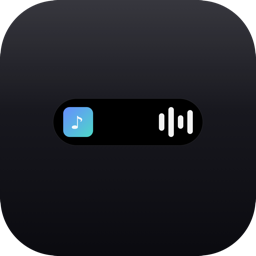
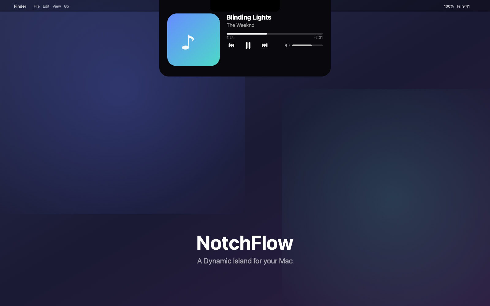
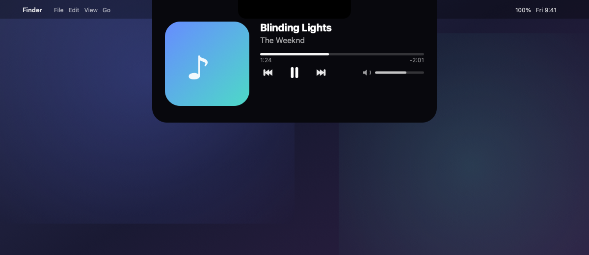
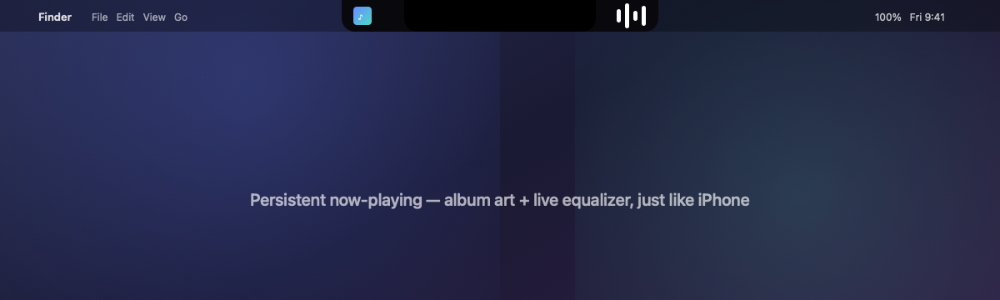
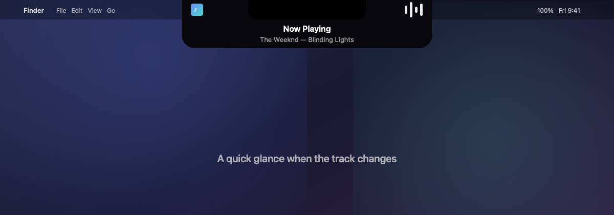

<div align="center">



# NotchFlow

### A Dynamic Island for your Mac 🎵

Turn the MacBook notch into a living, interactive island — a persistent now-playing
indicator while music plays, springing open into a beautiful media player on hover.
Works with **Spotify, Apple Music, YouTube in a browser** — anything macOS is playing.

[](https://github.com/VIK-DD/NotchFlow/releases/latest)
[](#-compatibility)
[](https://swift.org)
[](#-compatibility)
[](#-architecture)
[](LICENSE)

<br/>



</div>

---

## ✨ About

NotchFlow is a native macOS app (SwiftUI + AppKit) that transforms the notch — or the
top-center of any Mac — into an iPhone-style **Dynamic Island**. It reads playback from
the same system **Now Playing** source macOS uses for Control Center, so it shows
*whatever* is playing without accounts, tokens, or browser extensions.

- Idle → it shows the album art and a live equalizer hugging the notch.
- Hover → it springs open into a full player with scrubber, transport, and volume.
- Track change → a brief peek with the new song.

No menu-bar clutter. No Dock icon. Just your music, where the notch already is.

---

## 🎯 Features

- 🎵 **Universal player** — Spotify, Apple Music, YouTube/web, podcasts… via MediaRemote.
- 🪩 **Persistent now-playing** — album art + animated equalizer flank the notch while playing, exactly like iPhone.
- 🖱️ **Hover to expand** — full player: artwork, title, artist, source-app badge.
- ⏯️ **Real controls** — play / pause / next / previous, single-tap responsive.
- 📊 **Live scrubber** — smooth 120 fps progress, drag to seek.
- 🔊 **Volume** — system output volume, works for every source.
- 🎨 **Album-art accent** — UI subtly tints to a colour sampled from the artwork.
- 🌫️ **Blends with the bezel** — collapsed island is invisible; clicks outside it pass straight through to the menu bar.
- 👻 **Smart visibility** — fade/hide when idle, wake on Desktop, tunable opacity + delay.
- 🧩 **Plugin architecture** — new widgets (Battery, Weather, Calendar…) drop in with one line.
- 🪶 **Featherweight** — zero dependencies, no polling spam, tiny CPU/RAM footprint.
- 🖥️ **Universal binary** — native on Apple Silicon and Intel.

---

## 📸 Screenshots

<div align="center">

**Expanded player**



**Idle — persistent now-playing**



**Peek — track change glance**



</div>

---

## 📥 Installation

### Option A — Download the DMG (recommended)

1. Grab the latest **[NotchFlow.dmg](https://github.com/VIK-DD/NotchFlow/releases/latest)**.
2. Open it and drag **NotchFlow** into **Applications**.
3. Launch it. A small island appears at your notch.

> **First launch:** the build is ad-hoc signed (no paid Apple Developer ID), so Gatekeeper
> says *"unidentified developer"*. Right-click the app → **Open** → **Open**. Once only.

### Option B — Build from source

```bash
git clone https://github.com/VIK-DD/NotchFlow.git
cd NotchFlow
swift run                       # run immediately
# or build a distributable bundle / installer:
./scripts/make_app_bundle.sh    # → build/NotchFlow.app
./scripts/make_dmg.sh           # → build/NotchFlow.dmg
```

Open in Xcode with `open Package.swift` (Xcode 14+).

---

## 💻 Compatibility

Universal binary — runs natively on **Apple Silicon** and **Intel**.

| macOS | Version | Status |
|-------|---------|--------|
| Monterey | 12 | ✅ Full *(minimum)* |
| Ventura | 13 | ✅ Full |
| Sonoma | 14 | ✅ Full |
| Sequoia | 15.0 – 15.3 | ✅ Full |
| Sequoia | 15.4+ | ⚠️ Notch UI works; Apple restricted third-party *Now Playing* reads, so playback info may not appear |

The notch detection uses APIs introduced in macOS 12, hence the minimum. On Macs without a
physical notch, NotchFlow shows a compact pill at the top-center instead.

---

## 🧠 Architecture

Clean **MVVM** with a **plugin/widget** core. The notch shell knows nothing about media —
only the `NotchWidget` protocol. **Zero third-party dependencies.**

```
Sources/NotchFlow/
├── App/            Bootstrap (@main), AppDelegate, AppEnvironment
├── Notch/          Window, container (hit-test + hover), state machine, geometry
│   └── Views/      NotchShape, NotchRootView
├── Widgets/
│   ├── Widget.swift / WidgetRegistry.swift   plugin contract + registry
│   └── Player/     universal Now-Playing widget (VM, widget, views)
├── DesignSystem/   Theme, Animations, VisualEffectBlur, Formatting
├── Services/       MediaRemote, SystemAudio, AppleScriptRunner, LaunchAtLogin, ImageColor
└── Settings/       SettingsStore + SwiftUI preferences
```

**Data flow**

```
MediaRemote (system) ──notify/fetch──▶ NowPlayingViewModel ──@Published──▶ player views
        ▲                                     │
  any playing app                             └── WidgetEvent ──▶ WidgetRegistry ──▶ NotchViewModel
 (Spotify / Music / YouTube)                                                         │
                                                            drives island state + geometry
```

---

## ⚙️ How It Works

- **Overlay** — a borderless, non-activating `NSPanel` floats above the menu bar over the
  notch. It never steals focus; transparent regions pass clicks through to whatever's behind.
- **Playback** — read via the private **MediaRemote** framework (loaded with `dlopen`, no
  link-time dependency) — the same source as Control Center's Now Playing.
- **Performance** — the progress bar is advanced by a precise ticker only while open; idle
  costs essentially nothing.

---

## 🧩 Adding a Widget

1. Create a class conforming to `NotchWidget` (see `Player/NowPlayingWidget.swift`).
2. Register it in `AppEnvironment.registerWidgets()`:

```swift
widgetRegistry.register(BatteryWidget(...))
```

The notch automatically surfaces the highest-priority widget with live content and reacts
to its peek/expand events. Ready for Battery, Weather, Calendar, AirPods, Pomodoro, and more.

---

## 🗑️ Uninstall

Quit from the menu-bar icon, then delete `NotchFlow.app`. If you enabled *Launch at Login*,
toggle it off first (or it's harmless — the login item just points at the missing app).

---

## ⚠️ Known Limitations

- Playback uses a private framework; Apple tightened it on **macOS 15.4+** (see Compatibility).
- Not sandboxed — distributed directly, not via the Mac App Store.
- Volume controls **system** output volume, not per-app.

---

## 📜 License

[MIT](LICENSE) © 2026 VIK-DD

<div align="center">
<br/>
Built with ❤️ for the notch.
</div>
